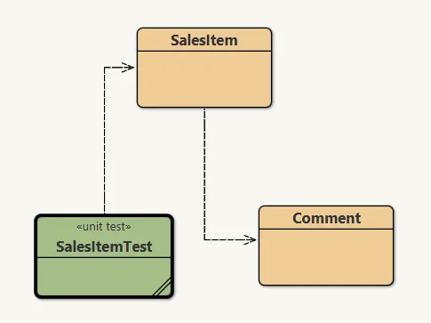
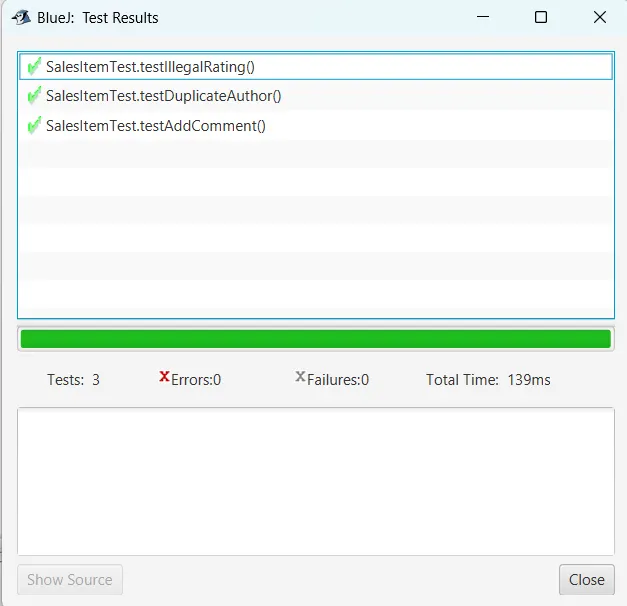

# Tugas 10 - Pemrograman Berorientasi Objek B

## Deskripsi
Assalamualaikum Warahamatullahi Wabarakatuh, 

Pada kuliah pertemuan kesepuluh dalam kelas Pemrograman Berorientasi Objek kelas B, saya ditugaskan untuk mempelajari dan mengimplementasikan **Testing and Debugging** dengan bahasa `JAVA` dan compiler `BlueJ`. Program ini mendemonstrasikan penggunaan **Unit Testing** menggunakan framework **JUnit** untuk sistem item penjualan dengan fitur komentar dan rating.

## Preview dan penjelasan

### Penjelasan
Untuk project kali ini diperlukan 3 class yaitu `SalesItem`, `Command`, dan `SalesItemTest`. 
Untuk source code dapat diakses melalui link di bawah ini:

- [SalesItem](SalesItem.java)
- [Command](Command.java)
- [SalesItemTest](SalesItemTest.java)

### Class yang Digunakan

**SalesItem Class**
- Merepresentasikan item produk dengan nama, harga, dan daftar komentar
- Method `addCommand()` menambahkan komentar dengan validasi:
  - Rating harus 1-5
  - Satu author hanya boleh berkomentar sekali

**Command Class**
- Merepresentasikan komentar dengan author, text, dan rating (1-5)

**SalesItemTest Class (JUnit Test)**
- `testAddCommand()` - test penambahan komentar valid
- `testIllegalRating()` - test validasi rating tidak valid (0)
- `testDuplicateAuthor()` - test validasi author duplikat

### Cara Menjalankan Program

1. Buka **BlueJ**, compile semua class
2. Untuk **manual testing**: Klik kanan `SalesItem` → buat object baru → panggil method
3. Untuk **unit testing**: Klik kanan `SalesItemTest` → pilih **Test All**
4. Lihat hasil test (hijau = pass, merah = fail)

### Preview

- **Struktur Class di BlueJ**
  

- **Hasil Test di BlueJ**
  

---

## Identitas
- **Nama**   : A. Wildan Kevin Assyauqi  
- **NRP**    : 5025241265  
- **Kelas**  : Pemrograman Berorientasi Objek - B
