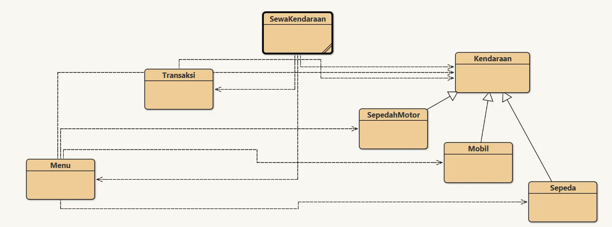
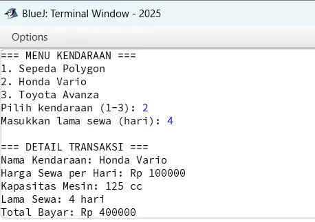

# Tugas 11 - Pemrograman Berorientasi Objek B

## Deskripsi
Assalamualaikum Warahamatullahi Wabarakatuh, 

Pada kuliah pertemuan kesebelas dalam kelas Pemrograman Berorientasi Objek kelas B, saya ditugaskan untuk mengimplementasikan **Aplikasi Rental Kendaraan** dengan bahasa `JAVA` dan compiler `BlueJ`. Program ini mendemonstrasikan konsep **Inheritance (Pewarisan)** dan **Polymorphism (Polimorfisme)** dalam OOP untuk sistem penyewaan Sepeda, Sepeda Motor, dan Mobil.

## Preview dan penjelasan

### Penjelasan
Untuk project kali ini diperlukan 7 class yaitu `Kendaraan` (parent class), `Sepeda`, `SepedaMotor`, `Mobil` (subclasses), `Menu`, `Transaksi`, dan `SewaKendaraan` (main class). 

Untuk source code dapat diakses melalui link di bawah ini:

- [Kendaraan](Kendaraan.java) - Parent Class
- [Sepeda](Sepeda.java)
- [SepedaMotor](SepedaMotor.java)
- [Mobil](Mobil.java)
- [Menu](Menu.java)
- [Transaksi](Transaksi.java)
- [SewaKendaraan](SewaKendaraan.java) - Main Class

### Class yang Digunakan

**Kendaraan Class (Parent)**
- Atribut: `nama`, `hargaSewaPerHari`
- Method: `infoKendaraan()`, `hitungSewa()` (dapat di-override)

**Sepeda, SepedaMotor, Mobil Class (Subclass)**
- Mewarisi dari `Kendaraan`
- Override `hitungSewa()` dengan perhitungan berbeda:
  - **Sepeda**: Diskon 10% untuk sewa > 3 hari
  - **SepedaMotor**: Biaya servis +Rp20.000 untuk sewa > 5 hari
  - **Mobil**: Biaya sopir +Rp100.000/hari jika kursi > 5

**Menu Class**
- Mengelola daftar kendaraan yang tersedia

**Transaksi Class**
- Mengelola transaksi penyewaan dan menghitung total biaya

**SewaKendaraan Class**
- Main class untuk menjalankan program

### Cara Menjalankan Program

1. Buka **BlueJ**, compile semua class
2. Klik kanan pada class `SewaKendaraan` → pilih `void main(String[] args)`
3. Pilih kendaraan (1-3)
4. Masukkan lama sewa (dalam hari)
5. Lihat detail transaksi dan total biaya

### Preview

- **Struktur Class di BlueJ**
  

- **Program Berjalan**
  

---

## Identitas
- **Nama**   : A. Wildan Kevin Assyauqi  
- **NRP**    : 5025241265  
- **Kelas**  : Pemrograman Berorientasi Objek - B