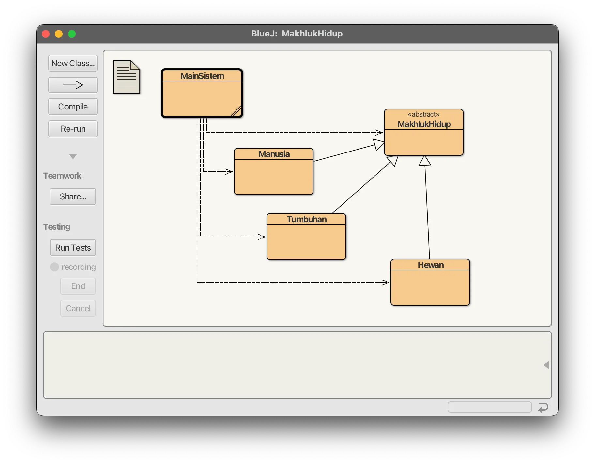
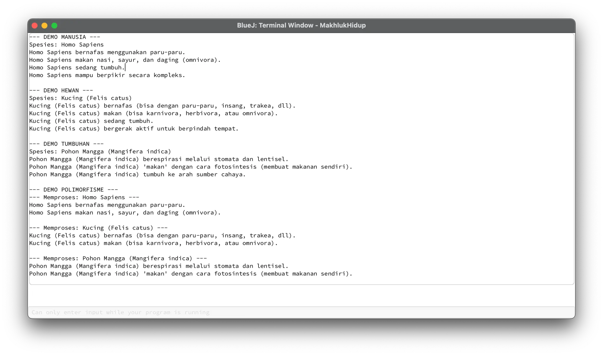
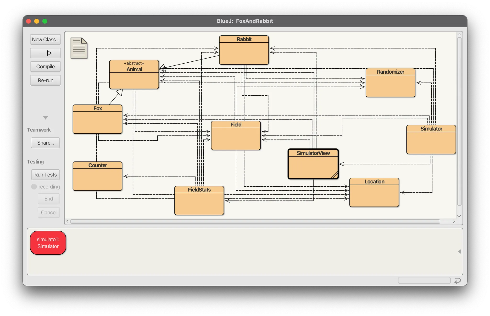
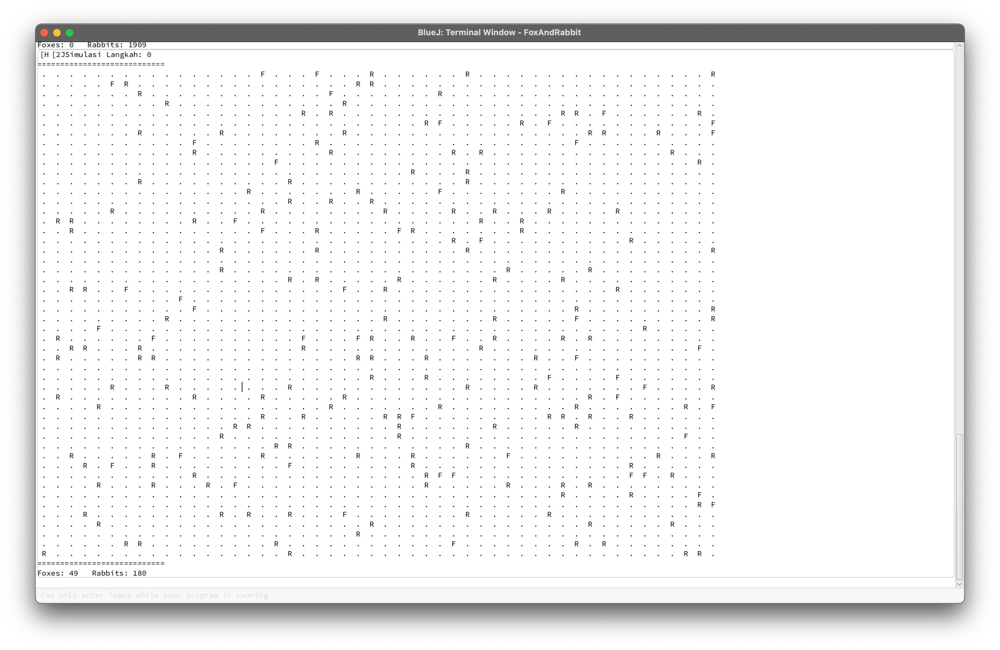

# Tugas 12 - Pemrograman Berorientasi Objek B

## Deskripsi
Assalamualaikum Warahamatullahi Wabarakatuh, 

Pada kuliah pertemuan kedua belas dalam kelas Pemrograman Berorientasi Objek kelas B, saya ditugaskan untuk mempelajari dan mengimplementasikan **Abstract Class** dengan bahasa `JAVA` dan compiler `BlueJ`. 

Tugas ini dibagi menjadi **2 bagian**:
- **Bagian A**: Abstract Class Makhluk Hidup (Manusia, Hewan, Tumbuhan)
- **Bagian B**: Simulasi Foxes and Rabbits dengan Abstract Class

---

# Bagian A: Abstract Class Makhluk Hidup

## Preview dan penjelasan

### Penjelasan
Untuk bagian ini diperlukan 4 class yaitu `MakhlukHidup` (abstract parent class), `Manusia`, `Hewan`, `Tumbuhan` (concrete subclasses), dan `MainSistem` (main class). 

Untuk source code dapat diakses melalui link di bawah ini:

- [MakhlukHidup](MakhlukHidup.java) - Abstract Parent Class
- [Manusia](Manusia.java)
- [Hewan](Hewan.java)
- [Tumbuhan](Tumbuhan.java)
- [MainSistem](MainSistem.java) - Main Class

### Class yang Digunakan

**MakhlukHidup Class (Abstract)**
- Abstract methods: `bernafas()`, `makan()` (wajib di-override)
- Concrete method: `tumbuh()`, `getNamaSpesies()`

**Manusia, Hewan, Tumbuhan Class**
- Mewarisi dari `MakhlukHidup`
- Override abstract methods dengan implementasi berbeda:
  - **Manusia**: Bernafas dengan paru-paru, makan omnivora
  - **Hewan**: Bernafas berbagai cara, makan sesuai jenis
  - **Tumbuhan**: Berespirasi via stomata, fotosintesis

**MainSistem Class**
- Demonstrasi polymorphism dengan `ArrayList<MakhlukHidup>`

### Cara Menjalankan Bagian A

1. Compile semua class (MakhlukHidup, Manusia, Hewan, Tumbuhan, MainSistem)
2. Klik kanan `MainSistem` → pilih `void main(String[] args)`
3. Lihat output demo individual dan polymorphism

### Preview Bagian A

- **Struktur Class**
  

- **Output Program**
  

---

# Bagian B: Simulasi Foxes and Rabbits

## Preview dan penjelasan

### Penjelasan
Untuk bagian ini diperlukan class `Animal` (abstract parent class), `Fox`, `Rabbit` (concrete subclasses), `Simulator`, `Field`, `Location`, dan supporting classes. 

Untuk source code dapat diakses melalui link di bawah ini:

**Core Classes:**
- [Animal](Animal.java) - Abstract Parent Class
- [Fox](Fox.java) - Predator
- [Rabbit](Rabbit.java) - Prey
- [Simulator](Simulator.java) - Main Controller

**Supporting:** Field, Location, SimulatorView, FieldStats, Counter, Randomizer

### Class yang Digunakan

**Animal Class (Abstract)**
- Abstract method: `act(List<Animal> newAnimals)` (wajib di-override)
- Concrete methods: `isAlive()`, `setDead()`, `setLocation()`

**Fox Class (Predator)**
- Berburu kelinci untuk makanan
- Berkembang biak jika umur ≥ 15
- Mati jika kelaparan atau umur > 150

**Rabbit Class (Prey)**
- Berkembang biak lebih cepat (umur ≥ 5)
- Mati jika umur > 40

**Simulator Class**
- Menjalankan simulasi predator-prey ecosystem
- Menampilkan visualisasi (putih = rabbit, orange = fox)

### Cara Menjalankan Bagian B

1. Compile semua class
2. Klik kanan `Simulator` → pilih `void main(String[] args)`
3. Window simulasi akan muncul menampilkan dinamika populasi

### Preview Bagian B

- **Struktur Class**
  

- **Simulasi Berjalan**
  

---

## Identitas
- **Nama**   : A. Wildan Kevin Assyauqi  
- **NRP**    : 5025241265  
- **Kelas**  : Pemrograman Berorientasi Objek - B
