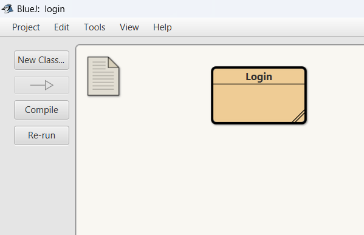
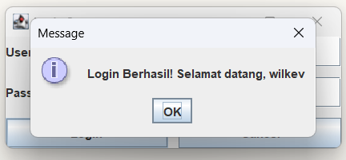
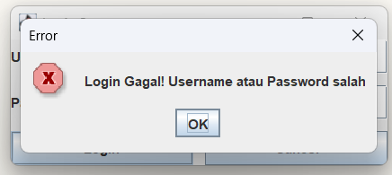

# Tugas 13 - Pemrograman Berorientasi Objek B

## Deskripsi
Assalamualaikum Warahamatullahi Wabarakatuh, 

Pada kuliah pertemuan ketiga belas dalam kelas Pemrograman Berorientasi Objek kelas B, saya ditugaskan untuk mengimplementasikan **Pemrograman GUI (Graphical User Interface)** menggunakan **Java Swing** dengan bahasa `JAVA` dan compiler `BlueJ`. Di mana saya membuat sistem login sederhana dengan antarmuka grafis.

## Preview dan penjelasan

### Penjelasan
Untuk project kali ini diperlukan 1 class yaitu `Login` yang mengimplementasikan GUI login system. 
Untuk source code dapat diakses melalui link di bawah ini:

- [Login](Login.java)

### Login Class
Class `Login` membuat GUI login system menggunakan Java Swing dengan komponen:
- `JFrame` - Window utama
- `JPanel` dengan `GridLayout` (3 baris, 2 kolom)
- `JLabel` - Label untuk "Username:" dan "Password:"
- `JTextField` - Input field untuk username dan password
- `JButton` - Tombol "Login" dan "Cancel"
- `JOptionPane` - Dialog untuk menampilkan hasil login

**Event Handling:**
- `LoginListener` - Inner class untuk handle klik button Login, melakukan validasi kredensial
- `CancelListener` - Inner class untuk handle klik button Cancel, mengosongkan input fields

**Kredensial Default:**
- Username: `wilkev`
- Password: `000`

### Cara Menjalankan Program

1. Buka **BlueJ**, compile `Login.java`
2. Klik kanan pada class `Login` → pilih `void main(String[] args)`
3. Window GUI akan muncul dengan form login
4. Input username dan password, lalu klik "Login"
5. Dialog akan muncul menampilkan hasil (berhasil/gagal)

### Preview

- **Struktur Class di BlueJ**
  

- **Login Berhasil**
  

- **Login Gagal**
  

---

## Identitas
- **Nama**   : A. Wildan Kevin Assyauqi  
- **NRP**    : 5025241265  
- **Kelas**  : Pemrograman Berorientasi Objek - B
