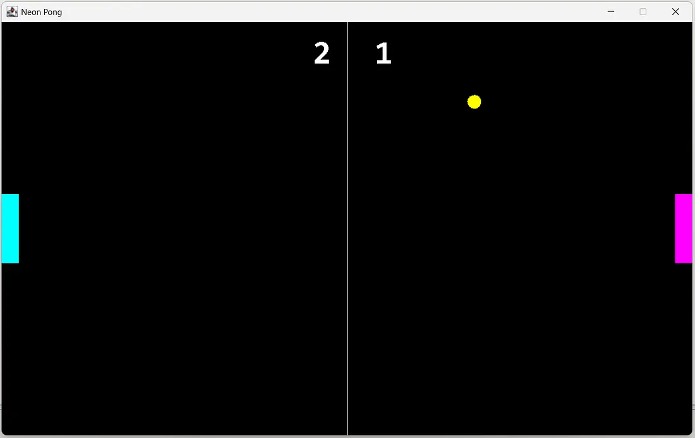
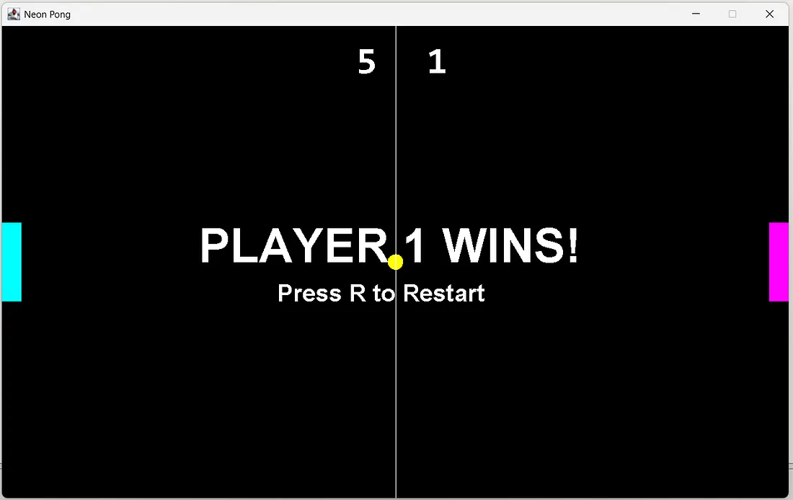

# Tugas 14 - Pemrograman Berorientasi Objek B

## Deskripsi
Assalamualaikum Warahamatullahi Wabarakatuh, 

Pada kuliah pertemuan keempat belas dalam kelas Pemrograman Berorientasi Objek kelas B, saya ditugaskan untuk mengimplementasikan **Game Pong** menggunakan **Java Swing** dengan bahasa `JAVA` dan compiler `BlueJ`. Game ini adalah permainan klasik Pong 2 pemain dengan GUI yang mendemonstrasikan konsep game loop, collision detection, dan event handling.

## Preview dan penjelasan

### Penjelasan
Untuk project kali ini diperlukan 5 class yaitu `GameFrame`, `GamePanel`, `Ball`, `Paddle`, dan `Score`. 

Untuk source code dapat diakses melalui link di bawah ini:

- [GameFrame](GameFrame.java) - Main Class
- [GamePanel](GamePanel.java) - Game Logic
- [Ball](Ball.java)
- [Paddle](Paddle.java)
- [Score](Score.java)

### Class yang Digunakan

**GameFrame Class**
- Extends `JFrame` sebagai window utama
- Setup window game dengan title "Neon Pong"
- Menambahkan `GamePanel` ke frame
- Entry point program dengan method `main()`

**GamePanel Class**
- Extends `JPanel` dan implements `Runnable` untuk game loop
- Mengatur game logic:
  - Update posisi ball dan paddle setiap frame (60 FPS)
  - Collision detection (ball vs paddle, ball vs wall)
  - Scoring system (maksimal 5 poin)
  - Game over detection dan restart
- Event handling untuk keyboard input (W/S dan UP/DOWN)

**Ball Class**
- Extends `Rectangle` untuk collision detection
- Gerakan bola dengan kecepatan yang bisa bertambah
- Methods: `update()`, `bounceX()`, `bounceY()`, `accelerate()`
- Render sebagai oval kuning

**Paddle Class**
- Extends `Rectangle` untuk collision detection
- Kontrol paddle:
  - Player 1: W (atas), S (bawah) - Warna Cyan
  - Player 2: UP (atas), DOWN (bawah) - Warna Magenta
- Menyimpan skor masing-masing pemain

**Score Class**
- Menampilkan skor kedua pemain di tengah layar
- Font besar warna putih

### Kontrol Game

- **Player 1 (Kiri - Cyan)**: W (naik), S (turun)
- **Player 2 (Kanan - Magenta)**: Arrow UP (naik), Arrow DOWN (turun)
- **Restart Game**: Tekan R setelah game over

### Aturan Game

- First to 5 points wins
- Bola bertambah cepat setiap memantul di paddle
- Game over saat salah satu pemain mencapai 5 poin
- Tekan R untuk restart

### Cara Menjalankan Program

1. Buka **BlueJ**, compile semua class
2. Klik kanan pada class `GameFrame` → pilih `void main(String[] args)`
3. Window game akan muncul (1000x600 pixels)
4. Gunakan kontrol keyboard untuk bermain
5. Game berjalan pada 60 FPS dengan game loop

### Preview

- **Game Awal**
  

- **Game Berjalan & Player 1 Menang**
  

---

## Identitas
- **Nama**   : A. Wildan Kevin Assyauqi  
- **NRP**    : 5025241265  
- **Kelas**  : Pemrograman Berorientasi Objek - B
