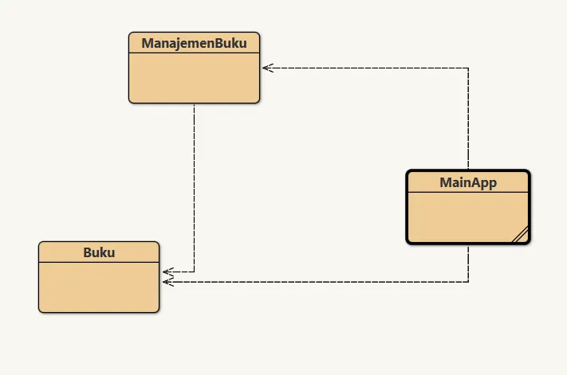

# Tugas 15 - Pemrograman Berorientasi Objek B

## Deskripsi
Assalamualaikum Warahamatullahi Wabarakatuh, 

Pada kuliah pertemuan kelima belas dalam kelas Pemrograman Berorientasi Objek kelas B, saya ditugaskan untuk mengimplementasikan **Aplikasi Manajemen Buku** dengan bahasa `JAVA` dan compiler `BlueJ`. Aplikasi ini merupakan sistem CRUD (Create, Read, Update, Delete) sederhana untuk mengelola data buku menggunakan `ArrayList`.

## Preview dan penjelasan

### Penjelasan
Untuk project kali ini diperlukan 3 class yaitu `Buku`, `ManajemenBuku`, dan `MainApp` (main class). 

Untuk source code dapat diakses melalui link di bawah ini:

- [Buku](Buku.java)
- [ManajemenBuku](ManajemenBuku.java)
- [MainApp](MainApp.java) - Main Class

### Class yang Digunakan

**Buku Class**
- Model class untuk merepresentasikan buku
- Atribut: `id`, `judul`, `penulis`, `tahun`
- Methods: Constructor, getter/setter, `toString()`

**ManajemenBuku Class**
- Mengelola koleksi buku menggunakan `ArrayList<Buku>`
- CRUD Operations:
  - `tambahBuku()` - Menambah buku baru ke daftar
  - `tampilBuku()` - Menampilkan semua buku
  - `ubahBuku()` - Mengubah data buku berdasarkan ID
  - `hapusBuku()` - Menghapus buku berdasarkan ID

**MainApp Class**
- Main class dengan menu interaktif console
- 5 Menu utama:
  1. Tambah Buku
  2. Lihat Buku
  3. Ubah Buku
  4. Hapus Buku
  5. Keluar

### Fitur Aplikasi

**1. Tambah Buku**
- Input: ID, Judul, Penulis, Tahun Terbit
- Menambahkan buku baru ke ArrayList

**2. Lihat Buku**
- Menampilkan semua data buku
- Format: ID | Judul | Penulis | Tahun

**3. Ubah Buku**
- Input: ID buku yang akan diubah
- Update Judul, Penulis, dan Tahun Terbit
- Validasi jika ID tidak ditemukan

**4. Hapus Buku**
- Input: ID buku yang akan dihapus
- Menghapus buku dari ArrayList
- Validasi jika ID tidak ditemukan

### Cara Menjalankan Program

1. Buka **BlueJ**, compile semua class
2. Klik kanan pada class `MainApp` → pilih `void main(String[] args)`
3. Program akan menampilkan menu di console
4. Pilih menu (1-5) sesuai operasi yang diinginkan
5. Ikuti instruksi input untuk setiap operasi
6. Pilih menu 5 untuk keluar

### Preview

- **Struktur Class**
  

- **Program Berjalan**
  

---

## Identitas
- **Nama**   : A. Wildan Kevin Assyauqi  
- **NRP**    : 5025241265  
- **Kelas**  : Pemrograman Berorientasi Objek - B
