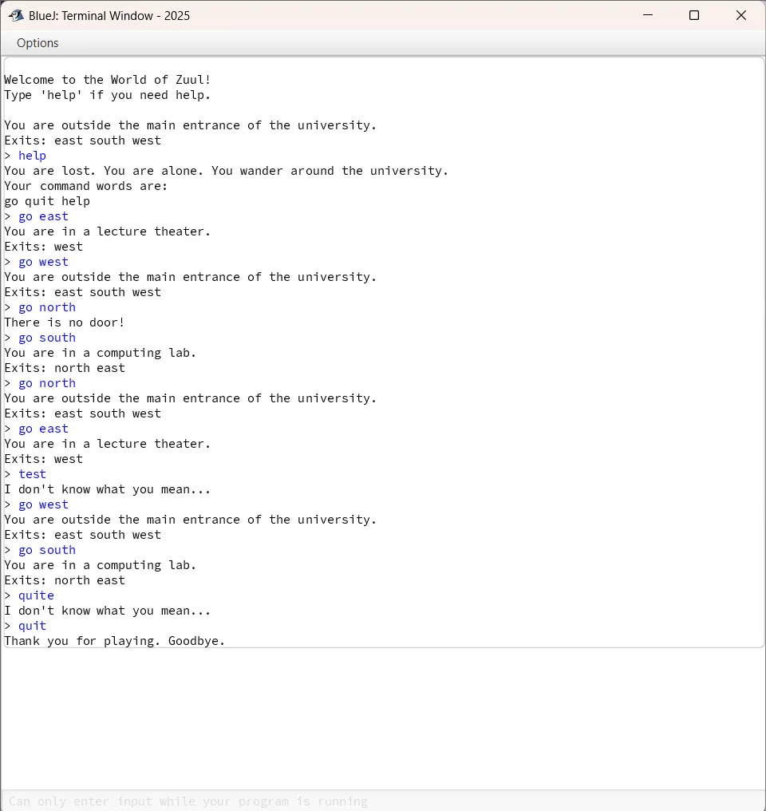

# Tugas 9 - Pemrograman Berorientasi Objek B

## Deskripsi
Assalamualaikum Warahamatullahi Wabarakatuh, 

Pada kuliah pertemuan kesembilan dalam kelas Pemrograman Berorientasi Objek kelas B, saya ditugaskan untuk mengimplementasikan game petualangan sederhana **World of Zuul** dengan bahasa `JAVA` dan compiler `BlueJ`. Game ini merupakan petualangan berbasis teks di mana pemain dapat berpindah antar ruangan di kampus universitas.

## Preview dan penjelasan

### Penjelasan
Untuk project kali ini diperlukan 4 class yaitu `Game`, `Parser`, `CommandWords`, dan `Command`. 
Untuk source code dapat diakses melalui link di bawah ini:

- [Game](Game.java)
- [Parser](Parser.java)
- [CommandWords](CommandWords.java)
- [Command](Command.java)

### Class yang Digunakan

**Game Class**
- Mengatur jalannya permainan dan menciptakan ruangan (outside, theater, pub, lab, office)
- Memproses command dari player (help, go, look, quit)
- Entry point utama dengan method `main()`

**Parser Class**
- Membaca dan mem-parsing input dari user menggunakan `Scanner`
- Mengembalikan object `Command` berisi command word dan parameter

**CommandWords Class**
- Menyimpan daftar command yang valid: "go", "help", "look", "quit"
- Validasi apakah input merupakan command yang sah

**Command Class**
- Merepresentasikan command yang diinput user
- Menyimpan command word dan second word (parameter)

### Cara Menjalankan Program

1. Buka **BlueJ**, compile semua class
2. Klik kanan pada class `Game` → pilih `void main(String[] args)`
3. Ketik command yang tersedia:
   - `help` - menampilkan bantuan
   - `go [direction]` - berpindah arah (east, west, north, south)
   - `look` - melihat deskripsi ruangan
   - `quit` - keluar dari game

### Preview

- **Tampilan Game Setelah Dijalankan**
  

---

## Identitas
- **Nama**   : A. Wildan Kevin Assyauqi  
- **NRP**    : 5025241265  
- **Kelas**  : Pemrograman Berorientasi Objek - B
